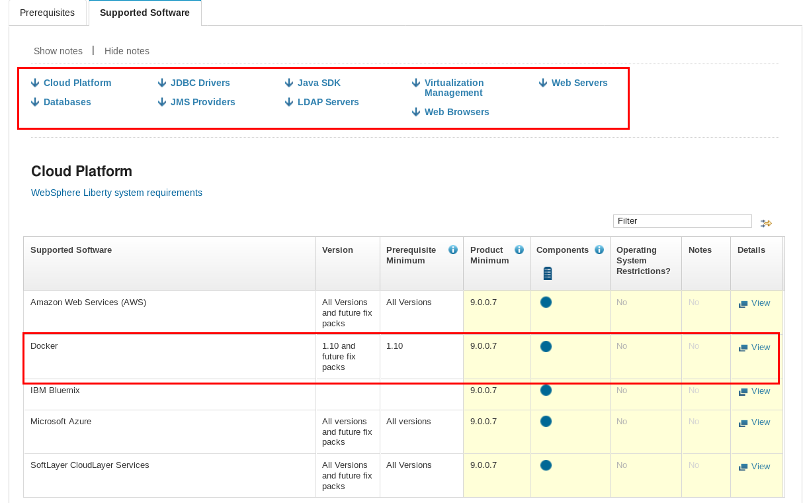

 IBM Tools for Software

## Proposito del Material
El propósito del siguiente material es proveer a la comunidad de enlaces e información de utilidad para el manejo en general de Software IBM. El presente documento no constituye información oficial de IBM , simplemente es una guía con herramientas que pueden ser usadas por los interesados.

# Tabla de contenido
1. [Compatibilidad de Software](#1-compatibilidad-de-software)
    - 1.1 [Sistemas Operativos](#11-sistemas-operativos)
    - 1.2 [Software Relacionado](#12-software-relacionado)
    - 1.3 [Reportes Detallados](#13-reportes-detallados)
2. [Acuerdo de Licenciamiento por Producto](#2-acuerdo-de-licenciamiento-por-producto)
3. [Ciclo de vida de los Productos](#3-ciclo-de-vida-de-los-productos)
4. [Tabla de PVUs por Tecnología](#4-tabla-de-pvus-por-tecnología)
5. [Software Support Handbook](#5-software-support-handbook)      
6. [Cartas de Anuncio](#6-cartas-de-anuncio)
7. [Knowledge Center (Información técnica detallada)](#7-knowledge-center)
8. [Developer Works (Comunidad)](#8-developerworks)
9. [IBM Redbooks](#9-ibm-redbooks)

# 1. Compatibilidad de Software
El análisis de comtatibilidad es de mucha importancia al momento de diseñar nuevas arquitecturas, el sistema operativo a ser usado,las características de hardware e hypervisores y el software relacionado son de suma importancia para el diseño de soluciones. Para esto IBM proveé un sitio web en donde se puede realizar estas consultas para cualquiera de sus productos.

El sitio web mencionado es:

[Software Product Compatibility Reports](https://www.ibm.com/software/reports/compatibility/clarity/index.html).

## 1.1. Sistemas Operativos
- Para el análisis de sistemas operativos ingresamos al link
- Una vez dentro seleccionamos la opción **Operating systems** y damos click en **Create a report**

- En la siguiente ventana colocamos el producto del cual requerimos información como **Websphere Application Server**, lo seleccionamos de la lista, escogemos la versión adecuada y damos click en **Submit** para generar el reporte.

- El reporte será generado, el mismo incluye la información de todas las versiones de sistemas operativos soportados para el producto seleccionado.

## 1.2. Software Relacionado
- Para el análisis de software relacionado ingresamos al link
- Una vez dentro seleccionamos la opción **Related software** y damos click en **Create a report**

- En la siguiente ventana colocamos el producto del cual requerimos información como **Websphere Application Server**, lo seleccionamos de la lista, escogemos la versión adecuada y damos click en **Submit** para generar el reporte.

- El reporte será generado, el mismo incluye la información del software soportado para el producto seleccionado.

## 1.3. Reportes Detallados
- Para obtener un reporte detalado ingresamos al link
- Una vez dentro en la sección **In-depth reports** damos click en **Create a report**

- En la siguiente ventana colocamos el producto del cual requerimos información como **Websphere Application Server**, lo seleccionamos de la lista, escogemos la versión adecuada y damos click en **Submit** para generar el reporte.

- El reporte será generado, el mismo incluye la información detallada del producto seleccionado.

# 2. Acuerdo de Licenciamiento por Producto

# 3. Ciclo de vida de los Productos
Es importante saber las fechas hasta las cuales los diferentes productos cuentan con soporte, esta información nos permitirá principalmente poder establecer estrategias adecuadas de migración. Para esto IBM proveé un sitio web en donde se puede realizar estas consultas para cualquiera de sus productos.

El sitio web mencionado es:

[Software lifecycle](http://www-01.ibm.com/software/support/lifecycle/).

- Para la consulta de información ingresamos al link
- Una vez dentro colocamos el producto deseado como: **Websphere Application Server** y damos click en **Search**

- Una vez procesada la búsqueda, buscamos el producto y la versión que estamos verificando y encontraremos la fecha de **End of Support**

# 4. Tabla de PVUs por Tecnología 
Gran parte del software IBM viene licenciado por un métrica llamada PVU(Processor Value Unit),el número de PVUs depende directamente del tipo de servidor sobre el que se vaya a instalar el software, el siguiente link muestra los diferentes valores dependiendo de la tecnología usada.

[Processor Value Unit Table](https://www-01.ibm.com/software/passportadvantage/pvu_licensing_for_customers.html).

# 5. Software Support Handbook 
El siguiente link tiene toda la información de importancia para el manejo de soporte de productos IBM.

[Software Support Handbook](https://www-304.ibm.com/support/customercare/sas/f/handbook/getsupport.html).

# 6. Cartas de Anuncio
El siguiente link tiene toda la información de importancia que emite IBM acerca de actualizaciones y lanzamientos de productos. 

[Cartas de Anuncio](https://www-01.ibm.com/common/ssi/apilite?infotype=an&infosubt=ca&lastdays=7&ctvwcode=us&hitlimit=200&appname=USN).

# 7. Knowledge Center
El siguiente link contiene información técnica detallada de los productos, se podrá encontrar información acerca de: instalación, administración, mantenimiento, comandos, etc. 

El sitio web mencionado es:

[Knowledge Center](https://www.ibm.com/support/knowledgecenter/).

- Para la búsqueda de información ingresamos al link
- Una vez dentro colocamos el producto deseado como: **Websphere Application Server** y damos click en el ícono de **Search**

- Luego de realizar la búsqueda seleccionamos el producto deseado y de presentará la pantalla inicial del producto, en esta podemos ver la tabla de contenido de toda la información y además podemos cambiar de verión.

# 8. DeveloperWorks
Es un sitio de mucha utilidad a la hora de encontrar información acerca de tutoriales, herramientas, foros y algunos cursos.Es posible que para utilizar este sitio se necesite una credencial IBMID, la misma que se puede crear de forma gratuita.

[DeveloperWorks](https://www.ibm.com/developerworks/).

# 9. IBM Redbooks
El contenido de IBM Redbooks es desarrollado y publicado por el Grupo de Servicios Digitales de IBM, Technical Content Services (TCS), antes conocido como ITSO. TCS desarrolla y ofrece habilidades, conocimientos técnicos y materiales a profesionales técnicos de IBM, socios comerciales, clientes y al mercado en general. Nuestros productos de información de valor agregado abordan perspectivas de productos, plataformas y soluciones. Exploran la integración, implementación y operación de escenarios de clientes que incluyen PeopleSoft, Linux, Windows, SAP, Oracle y otros.

El contenido principal de IBM Redbooks generalmente proporciona orientación de posicionamiento y valor, experiencias de instalación e implementación, escenarios típicos de soluciones y pautas paso a paso de "how to". Refleja experiencias de trabajo sobre un tema específico y, a menudo, incluye código de muestra y otros materiales de soporte que también están disponibles como descargas de este sitio. El contenido de Redbooks más corto (como documentos y guías) a menudo se enfoca en una visión empresarial de la tecnología que resuelve problemas comerciales, proporciona valor comercial o permite una ventaja competitiva aplicando tecnologías existentes o explorando un mapa de ruta para las tecnologías emergentes.

[IBM Redbooks](http://www.redbooks.ibm.com/).
